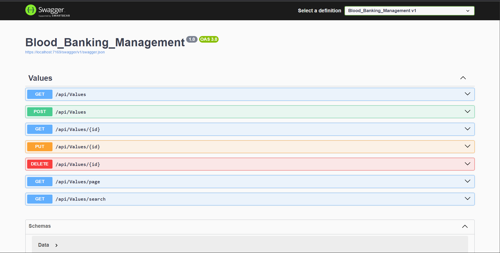
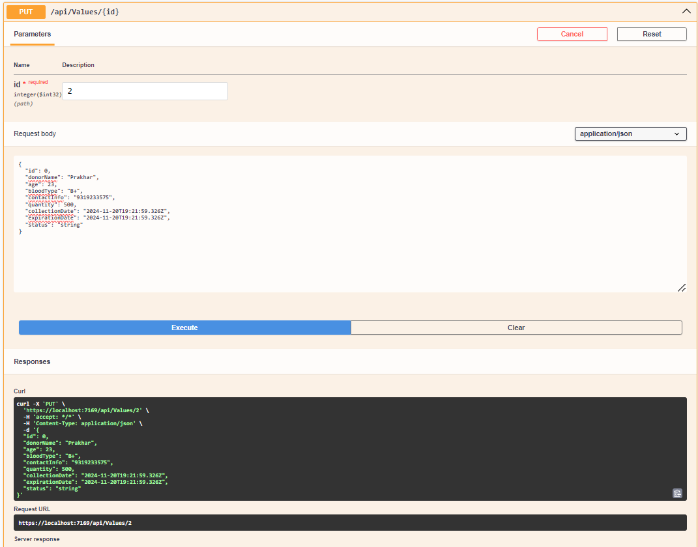
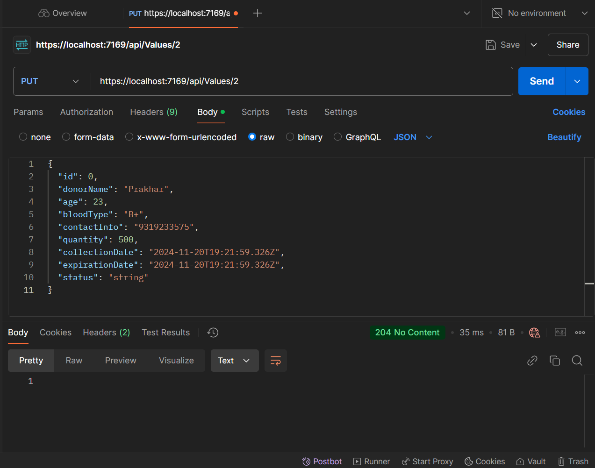
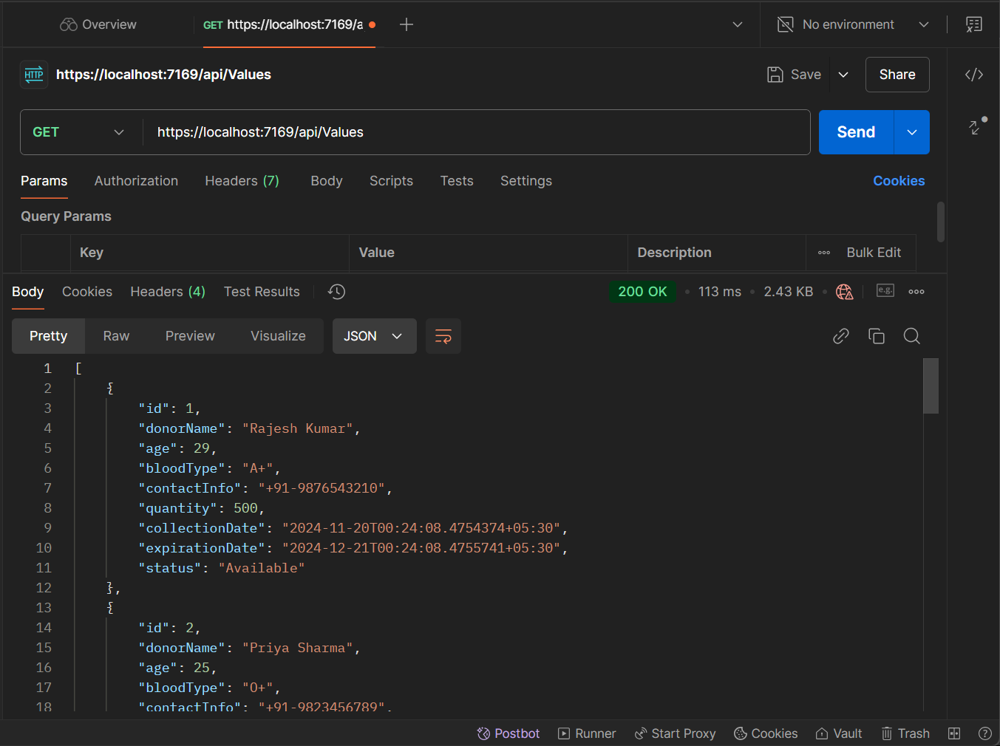
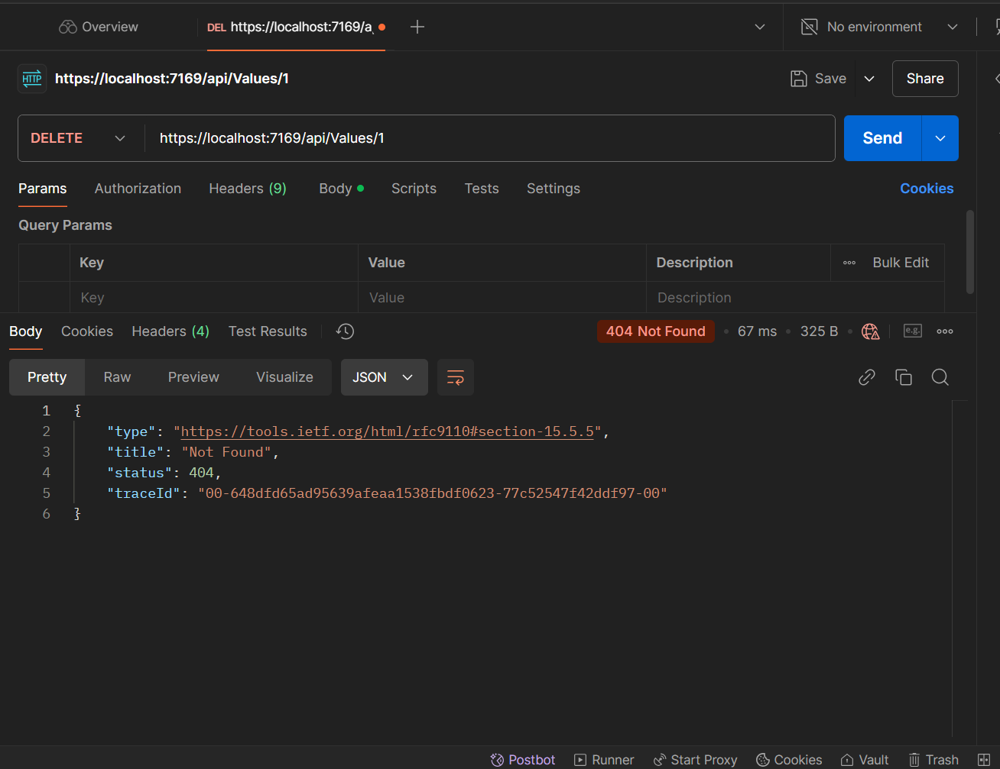
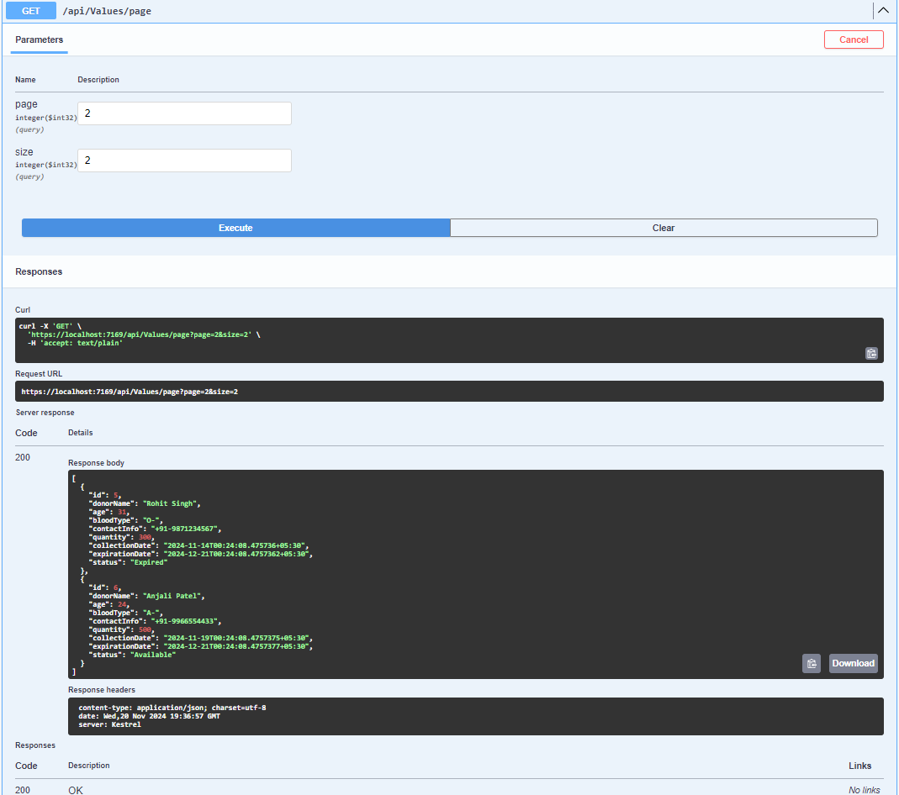

# Blood Bank Management API

## Project Overview
This is a RESTful API for managing a Blood Bank system, developed using C# and ASP.NET Core. The API allows users to perform CRUD operations, search for blood bank entries based on various parameters, and paginate results. The data is stored in an in-memory list for demonstration purposes.

## **Features**

- **CRUD Operations**: Create, read, update, and delete blood bank entries.
- **Search Functionality**: Search entries by blood type, status, or donor name.
- **Pagination**: Retrieve paginated lists of blood bank entries.
- **Error Handling**: Provides meaningful error messages for invalid or non-existent requests.
- **API Documentation**: Fully documented using Swagger for testing and exploration.


## Prerequisites
- **.NET SDK** : Version 6.0 or higher
- **Development Environment**: Visual Studio, VS Code , or JetBrains Rider.
- **Tools** : Postman (optional for Manual Testing)

### **Steps to Run the Project**

1. **Clone the Repository**
   ```bash
   git clone https://github.com/your-repo/blood-bank-management.git
   cd blood-bank-management
2. **Build The Project**
3. **Run the Application**
   ```bash
   dotnet run
4. **Access The API**
-  it will be on your local host
-  in my case it is https://localhost:7169

## **How to Test EndPoints**
### using Swagger:
1. Open a browser and navigate to the Swagger UI at https://localhost:7169/swagger
2. Explore all available endpoints, input data as required, and test the functionality.
### using PostMAn
1. import the following API requests or manually configure then
   - base URl: https://localhost:7169/api/Values
   - **For Search**
       -  GET /api/bloodbank/search?bloodType=A+
       -  GET /api/bloodbank/search?status=Available

## 1. CRUD Operations

| Method | Endpoint              | Description                       |
|--------|-----------------------|-----------------------------------|
| POST   | `/api/bloodbank`      | Add a new blood bank entry.      |
| GET    | `/api/bloodbank`      | Get all blood bank entries.      |
| GET    | `/api/bloodbank/{id}` | Get a specific entry by its ID.  |
| PUT    | `/api/bloodbank/{id}` | Update an entry by its ID.       |
| DELETE | `/api/bloodbank/{id}` | Delete an entry by its ID.       |
---

*Swagger UI showcasing all endpoints*
---

*Swagger UI showcasing Add Data*

*PostMan UI showcasing Add Data*
___

*Swagger UI showcasing All Data*

*PostMan UI showcasing All Data*
___

*Swagger UI showcasing delete Data by id*

*PostMan UI showcasing delete Data by id*
### *As is showing status=404 and title="NOT FOUND" because i have delete the same id above*

---

## 2. Pagination

| Method | Endpoint                                | Description                     |
|--------|-----------------------------------------|---------------------------------|
| GET    | `/api/bloodbank?page={page}&size={size}` | Retrieve entries with pagination. |

---
### *As is showing data with id=5 and id=6  because i have delete the id=1 and id=2 (page=2 and size=2)*

*Swagger UI showcasing Add Data*

*PostMan UI showcasing Add Data*
## 3. Search

| Method | Endpoint                                       | Description                                |
|--------|------------------------------------------------|--------------------------------------------|
| GET    | `/api/bloodbank/search?bloodType={bloodType}`  | Search entries by blood type.             |
| GET    | `/api/bloodbank/search?status={status}`        | Search entries by status (e.g., Available).|
| GET    | `/api/bloodbank/search?donorName={donorName}`  | Search entries by donor name.             |


